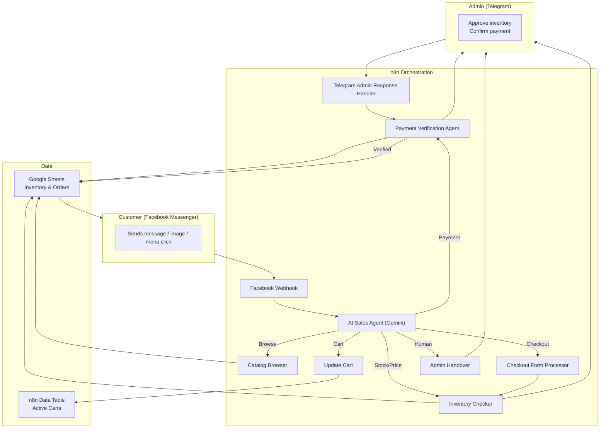

# AI Sales Agent — Infinity Tech Cosmetics

**AI Automation Specialist · n8n · LLM Agents · Messenger Commerce**

A fully conversational **Facebook Messenger sales agent** for a cosmetics business. It handles product discovery, cart management, checkout, payment verification, and admin handover — all within Messenger, with a human admin loop over Telegram.

---

## Problem

Selling cosmetics over Messenger in Myanmar means juggling:
- Replying to the same product and price questions repeatedly
- Manually checking stock and calculating tiered pricing (retail / wholesale / bulk / super-bulk)
- Collecting customer details and payment screenshots one by one
- Verifying payment slips and matching them to orders
- Escalating tricky requests to a human admin

## Solution

A multi-tool **AI sales agent** built in n8n with a Gemini LLM orchestrator. The agent speaks Burmese, browses a live inventory, manages a per-customer cart, checks stock and tiered prices, collects checkout details, verifies payment screenshots with AI vision, and finalizes orders after admin confirmation.

---

## Key Features

- **Natural Burmese conversations** — greet customers, answer questions, and guide them through the purchase flow.
- **Product browsing carousel** — customers pick a category; the agent returns a Facebook Generic Template carousel with images, prices, and "Buy" buttons.
- **Product search** — customers type or send an image of a product; the agent matches it to inventory.
- **Persistent cart** — per-customer cart stored in n8n Data Tables with add, update, and overwrite support.
- **Dynamic inventory & pricing** — checks stock and applies retail / wholesale / bulk / super-bulk price tiers from Google Sheets.
- **Checkout form** — n8n form collects name, phone, address, and payment method (KPay / Wave / Cash on Delivery).
- **Payment verification** — AI vision extracts transaction ID, amount, sender/receiver, and payment platform from a screenshot and flags mismatches.
- **Admin confirmation loop** — every order and payment is forwarded to a Telegram admin for approval before inventory is updated and the order is closed.
- **Human handover** — agent escalates to a Facebook inbox handover when the customer asks to speak to a human.

---

## Tech Stack

| Layer | Tools |
|-------|-------|
| **Automation platform** | n8n (native + LangChain nodes) |
| **LLM** | Gemini 2.5 Flash via OpenRouter |
| **Messaging** | Facebook Messenger (Graph API v19/v25), Telegram |
| **Inventory & orders** | Google Sheets |
| **Cart state** | n8n Data Tables |
| **Vision / verification** | AI image analysis of payment screenshots |
| **Languages** | JavaScript, JSON expressions |

---

## n8n Workflows Included

All import-ready workflow JSON files are in [`workflows/`](workflows/):

| Workflow | Purpose |
|----------|---------|
| `Cosmetics Sales Agent.json` | Main Facebook Messenger webhook, intent handling, LLM orchestration, and response routing |
| `Cosmetics - Catalog Browser.json` | Returns a Facebook product carousel by category from Google Sheets inventory |
| `Cosmetics - Update Cart.json` | Adds / updates items in the customer's cart stored in n8n Data Tables |
| `Cosmetics - Inventory Checker.json` | Validates stock and calculates tiered pricing; sends order summary to admin for approval |
| `Checkout Form Processor.json` | n8n form trigger that collects checkout details and calls the inventory checker |
| `Cosmetics - Payment Verification Agent.json` | AI vision verification of payment screenshots and admin confirmation workflow |
| `Cosmetics - Telegram Admin Response Handler.json` | Parses admin Telegram replies and resumes payment / inventory workflows |
| `Admin Handover.json` | Notifies admin on Telegram and passes thread control to Facebook Inbox |

---

## Sales Flow

1. **Greeting** — customer says hello; bot shows menu (Browse / Buy / Ask).
2. **Browse** — customer picks a category; carousel of in-stock products is sent.
3. **Select** — customer taps "Buy" or types a product name and quantity.
4. **Cart** — agent adds to cart and confirms running total.
5. **Checkout** — customer clicks checkout and fills the form (name, phone, address, payment method).
6. **Inventory check & admin approval** — the agent locks stock, computes pricing tiers, and asks the admin to approve.
7. **Payment** — customer uploads a payment screenshot.
8. **AI verification** — the agent reads the screenshot for amount, sender, receiver, transaction ID, and date.
9. **Admin confirmation** — final human check via Telegram reply.
10. **Order completion** — order is appended to Google Sheets, stock is updated, and the customer receives a receipt.

---

## Impact

- **Automates the full Messenger sales cycle** from first message to verified order.
- **Eliminates manual price/stock lookups** by querying live Google Sheets inventory.
- **Reduces payment fraud risk** with AI screenshot verification plus human confirmation.
- **Keeps admin in the loop** for high-value decisions without needing to monitor Messenger all day.

---

## Setup (High Level)

1. Import the `workflows/*.json` files into n8n.
2. Configure credentials: Facebook Graph API, Telegram Bot, OpenRouter, Google Sheets OAuth2.
3. Create the `inventory` Google Sheet with columns: `Product Name`, `Category`, `Price_Retail`, `Price_Wholesale`, `Price_Bulk`, `Price_SuperBulk`, `Qty_Tier2`, `Qty_Tier3`, `Qty_Tier4`, `Instock`, `Product Image URL`.
4. Create the `Orders` Google Sheet with columns for order details.
5. Set the Telegram admin chat ID in the admin notification nodes (currently `5452598419`).
6. Connect the Facebook app webhook to the n8n Facebook Webhook URL and verify with `hub.verify_token=Lucky7`.

---

## Skills Demonstrated

- **Conversational commerce** — menu-driven flows, persistent carts, checkout forms
- **LLM agent design** — tool-calling, memory per Facebook sender ID, prompt engineering in Burmese
- **Vision automation** — AI-based payment slip extraction and verification
- **Human-in-the-loop** — Telegram admin approval with `Wait for Webhook` resume nodes
- **Platform integration** — Facebook Messenger, Telegram, Google Sheets, n8n Data Tables

---

## Get In Touch

- GitHub: [@yehtet-dev](https://github.com/yehtet-dev)
- Telegram: [@kiran_soe](https://t.me/kiran_soe)
- LinkedIn / Resume: available on request
